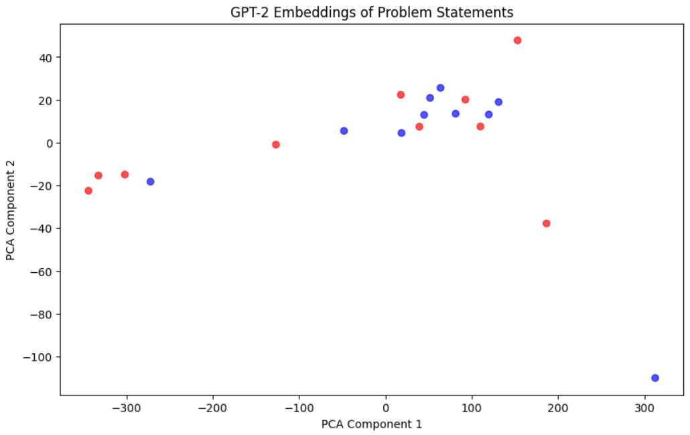

<!-- Title Slide -->
# Improving and Automating Testing using the LMs

**Denys Zinoviev (341946)**  

---

<!-- Agenda -->
## Agenda
- What do I want to achieve?
- Data & Scraping
- State of the Art
- Implementation Details
- File Structure
- Further Reading & Interesting Facts
- Data Samples & Embeddings Graphs
- Repository Links
- Team Members

---

<!-- What do I want to achieve? -->
## What do I Want to Achieve?
- **Explore** how language models can be used for generating unit tests.
- **Learn** something new.
- **Ideally**: Run a language model locally to generate tests from a problem statement and code.

---

<!-- Data -->
## Data
- **Competitive Problems**:
  - Easy to obtain.
  - Contain example tests.
  - Short solutions.
- **Disadvantages**:
  - Poor code quality.
  - Statements include non-technical information.
  - Problems are often hard.
- **Alternative**:
  - Considered using small-sized OS code (well-documented but harder to parse).

---

<!-- Scraper -->
## Scraper
- Implemented a scraper ([./scrape.ipynb](./scrape.ipynb)).
- **Note**:
  - Scraping statements works as expected.
  - Scraping solutions is problematic due to session token issues.
- **Output**:
  - 20 problem statements, each with:
    - Statement
    - Example tests
    - Time and memory limits
- Also downloaded a few ACMP statements (simpler and shorter).

---

<!-- Simplified Problems -->
## Simplified Problems
- Collected **60 ultra-simple one-liner problems**.
- Benefits:
  - Easier parsing for small language models.
  - Batch processing on GPU speeds things up (≈60× faster on pseudo-GPUs).

---

<!-- State of the Art -->
## State of the Art
- **Large LM performance**:
  - **o3-mini**: Generates correct test inputs for nearly all problems (prompt: problem statement + minimal instructions).
  - **4o**: About 60% correct outputs on non-trivial problems.
- **Conclusion**: Large models work pretty well for generating tests.

---

<!-- Implementation: GPT-2 -->
## Implementation – GPT-2
- **Direct Prompting**:  
  - Pasting the full problem statement failed (context too long).
- **Simplified Prompt**: `statement + "\n\nInput:"`
  - Improved test structure and digit usage.
  - Still resulted in nonsensical outputs.
- **Repetition Issue**:
  - Using the "repetition penalty" hyperparameter did not yield the expected improvements.

---

<!-- Implementation: Other Models -->
## Implementation – Other Models
- **GPT2-XL**:
  - Slightly better test structure.
  - Still suffers from repetition problems.
- **Code-based Models**:
  - **CodeGPT**: Failed completely at generating the rest of a function.
  - **StarCoder**: Began to generate a factorial function but switched to binomial coefficients (inference took 5 hours).

---

<!-- Simple Tests & Embeddings -->
## Simple Tests & Embeddings
- **Simple Tests**:
  - Easier for the small LM to handle.
  - Supports efficient batch processing.
- **Embeddings Exploration**:
  - Investigated the correlation between problem statements and generated tests.
  - Both statement and tests affect embeddings.
  - Mild separation observed when comparing different topics.

---

<!-- File Structure -->
## File Structure
- **unused/**: LLama and OSS OS code.
- **generated/**: Tests generated by the LM.
  - Folders include: `gpt2-0`, `gpt2-1`, `gpt2-3`, `gpt2-4`, `gpt2-5`, `gpt2-6`, `gpt2-simple-0`
- **scraped/**: Problem statements.
  - `statements/`: Codeforces statements.
  - `acmp/`: ACMP statements.
  - `simple/`: One-liners.
- **Notebooks**:
  - `gpt2.ipynb`: Generating tests using GPT2.
  - `code.ipynb`: Generating tests using code-based models.

---

<!-- Further Reading -->
## Further Reading & Interesting Facts
- **GPT o1 Overview**:  
  [Learning to Reason with LMs](https://openai.com/index/learning-to-reason-with-llms/)  
  - LM achieved ~1800 elo on Codeforces.
- **GPT o1 System Card**:  
  [Technical details & benchmarks](https://cdn.openai.com/o1-system-card.pdf#page=16)  
  - Extensive testing on various prompts (ethical, security, etc).

---

<!-- Data Samples -->
## Data Samples
```
### Problem ###
Compute the sum of all numbers in a given list where each number is positive and the list has at most ten elements.

### Test Case ###
Input:
6
2 5 8 11 14 17
Output:
24
```

---

<!-- Data Samples -->
## Data Samples
```
A. Insomnia cure time limit per test 2 seconds memory limit per test 256 megabytes input stdin output stdout «One dragon.
 Two dragon. Three dragon», — the princess was counting. She had trouble falling asleep, and she got bored of counting lambs 
 when she was nine. However, just counting dragons was boring as well, so she entertained herself at best she could. Tonight she
  imagined that all dragons were here to steal her, and she was fighting them off. Every k -th dragon got punched in the face with
   a frying pan. Every l -th dragon got his tail shut into the balcony door. Every m -th dragon got his paws trampled with sharp heels. 
   Finally, she threatened every n -th dragon to call her mom, and he withdrew in panic. How many imaginary dragons suffered moral or 
   physical damage tonight, if the princess counted a total of d dragons? Input Input data contains integer numbers k , l , m , n and d ,
    each number in a separate line ( 1 ≤ k , l , m , n ≤ 10 , 1 ≤ d ≤ 10 5 ). Output Output the number of damaged dragons. Examples Input
     1 2 3 4 12 Output 12 Input 2 3 4 5 24 Output 17 Note In the first case every first dragon got punched with a frying pan. Some of the 
     dragons suffered from other reasons as well, but the pan alone would be enough. In the second case dragons 1, 7, 11, 13, 17, 19 and 
     23 escaped unharmed.
```

---

<!-- Embeddings Graphs -->
## Embeddings Graphs
  <div style="display: flex; flex-wrap: wrap; gap: 20px; justify-content: center;">
     
  </div>

---

<!-- Repository Links -->
## Repository Links
- [**Code Repository**](https://github.com/rureirureirurei/uwr-llms/tree/master)
---

<!-- Questions -->
## Questions?
Thank you for your attention!
